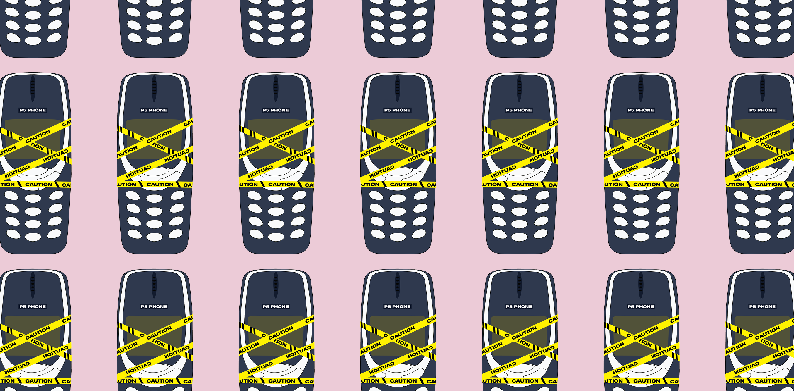

# p5-phone

*Illustration by [Angela Torchio](https://angelatorchio.com/)*

##  [Link for Interactive Examples](https://npuckett.github.io/p5-phone/examples/homepage)

## Maintainers

- **npm release and Web Editor sync:** [CONTRIBUTING.md](CONTRIBUTING.md)
- **Web Editor batch workflow (CORS server, catalog updates):** [docs/web-editor/](docs/web-editor/)
- **Migration log of sketch URLs:** [webeditorLinks.md](webeditorLinks.md)

# Overview
P5.js on mobile provides unique opportunities and challenges. The main P5 framework does an excellent job of making it easy to read data from various phone inputs and sensors, however it doesn't deal with the realities of contemporary browser's built in gestures and security protocols.
That's where this library comes in:

- Simplifies accessing phone hardware from the browser (accelerometers, gyroscopes, microphone, vibration motor)
- Simplifies disabling default phone gestures (Zoom, refresh, back, etc)
- Simplifies enabling audio output
- Simplifies using an on-screen console to display errors and debug info

## Agent Skills

p5-phone ships two optional **agent skills** that teach AI coding assistants (Claude Code, Cursor, ZCode, OpenCode, GitHub Copilot, etc.) how the library and p5.js 2.x work, so generated sketches use the right APIs and contemporary patterns.

- **p5-phone** — knowledge of how the library works, implementation patterns, and commands to simplify creating applications built with this library.
- **p5js-2x** — while the main library is optimized for p5 2.x, many models are trained on p5 1.x methods. This skill bridges the transition by pointing development to contemporary methods.

The skill files live in `.agents/skills/`, `.claude/skills/`, `.opencode/skills/`, and `.github/skills/` (kept byte-identical across all four). **See the [full guide for installing them for your particular workflow](docs/agent-skills.md).**

## p5 commands

This library simplifies access to the following p5.js mobile sensor and audio commands:

**Touch/Pointer Events:**
- [`mousePressed()`](https://p5js.org/reference/p5/mousePressed/) - Called when a press/touch begins (works for both mouse and touch in p5.js 1.x and 2.0)
- [`mouseReleased()`](https://p5js.org/reference/p5/mouseReleased/) - Called when a press/touch ends (works for both mouse and touch in p5.js 1.x and 2.0)
- [`touchStarted()`](https://p5js.org/reference/p5/touchStarted/) - Called when a touch begins (p5.js 1.x only)
- [`touchEnded()`](https://p5js.org/reference/p5/touchEnded/) - Called when a touch ends (p5.js 1.x only)

**Device Motion & Orientation:**
- [`rotationX`](https://p5js.org/reference/p5/rotationX/) - Device tilt forward/backward
- [`rotationY`](https://p5js.org/reference/p5/rotationY/) - Device tilt left/right
- [`rotationZ`](https://p5js.org/reference/p5/rotationZ/) - Device rotation around screen
- [`accelerationX`](https://p5js.org/reference/p5/accelerationX/) - Acceleration left/right
- [`accelerationY`](https://p5js.org/reference/p5/accelerationY/) - Acceleration up/down
- [`accelerationZ`](https://p5js.org/reference/p5/accelerationZ/) - Acceleration forward/back
- [`deviceShaken()`](https://p5js.org/reference/p5/deviceShaken/) - Shake detection event
- [`deviceMoved()`](https://p5js.org/reference/p5/deviceMoved/) - Movement detection event
- [`setShakeThreshold()`](https://p5js.org/reference/p5/setShakeThreshold/) - Set shake detection sensitivity
- [`setMoveThreshold()`](https://p5js.org/reference/p5/setMoveThreshold/) - Set movement detection sensitivity

**Audio Input (requires p5.sound):**
- [`p5.AudioIn()`](https://p5js.org/reference/p5.sound/p5.AudioIn/) - Audio input object
- [`p5.Amplitude()`](https://p5js.org/reference/p5.sound/p5.Amplitude/) + `amplitude.getLevel()` - Current audio input level (p5.sound 0.3.x has no `mic.getLevel()`; see [Microphone Activation](#microphone-activation))

## Browser Compatibility

- iOS 13+ (Safari)
- Android 7+ (Chrome)
- Chrome 80+
- Safari 13+
- Firefox 75+

## p5.js Version Compatibility

p5-phone supports both **p5.js 1.x** and **p5.js 2.0+**.

| Feature | p5.js 1.x | p5.js 2.0+ |
|---------|-----------|------------|
| Permission UI (Tap/Button/Canvas/Banner/Custom) | ✅ | ✅ |
| Motion sensors (rotationX/Y/Z, accelerationX/Y/Z) | ✅ | ✅ |
| Microphone / Speech / Sound | ✅ | ✅ |
| Camera (PhoneCamera) | ✅ | ✅ |
| Vibration | ✅ | ✅ |
| NFC Tag Reading (Android only) | ✅ | ✅ |
| GPS / Geolocation (iOS + Android) | ✅ | ✅ |
| Bluetooth Low Energy (Web Bluetooth) | ✅ | ✅ |
| Debug console | ✅ | ✅ |
| lockGestures() | ✅ | ✅ |
| `touchStarted()` / `touchEnded()` | ✅ | ❌ Use `mousePressed()` / `mouseReleased()` |
| `p5.registerAddon()` | ❌ | ✅ (auto-detected) |

**Key change in p5.js 2.0:** Touch-specific callbacks (`touchStarted`, `touchMoved`, `touchEnded`) are no longer dispatched. The unified Pointer API routes all input (mouse + touch) through `mousePressed()`, `mouseDragged()`, and `mouseReleased()`. These mouse callbacks work in **both** p5.js 1.x and 2.0, so use them for forward-compatible code.

p5-phone automatically detects the p5.js version and adjusts its internal touch override behavior accordingly. No configuration needed.

## Table of Contents

- [Link for Interactive Examples](#link-for-interactive-examples)
- [Maintainers](#maintainers)
- [Browser Compatibility](#browser-compatibility)
- [p5.js Version Compatibility](#p5js-version-compatibility)
- [CDN (Recommended)](#cdn-recommended)
- [Basic Setup](#basic-setup)
  - [Index HTML](#index-html)
  - [p5.js](#p5js)
- [API Reference](#api-reference)
  - [Core Functions](#core-functions)
  - [Status Variables](#status-variables)
  - [lockGestures()](#lockgestures)
  - [Motion Sensor Activation](#motion-sensor-activation)
  - [Microphone Activation](#microphone-activation)
  - [Sound Output Activation](#sound-output-activation)
  - [Speech Recognition Activation](#speech-recognition-activation)
  - [Combined Activation](#combined-activation)
  - [Vibration Motor (Android Only)](#vibration-motor-android-only)
  - [Torch / Flashlight (Android Chrome)](#torch--flashlight-android-chrome)
  - [NFC Tag Reading (Android Only)](#nfc-tag-reading-android-only)
  - [GPS / Geolocation (iOS + Android)](#gps--geolocation-ios--android)
  - [PhoneCamera (ML5 Integration)](#phonecamera-ml5-integration)
  - [Debug System](#debug-system)
- [Permission UI Styles](#permission-ui-styles)
  - [Tap (Full-Screen Overlay)](#tap-full-screen-overlay)
  - [Button (Centered Button)](#button-centered-button)
  - [Canvas (First Touch)](#canvas-first-touch)
  - [Banner (Top/Bottom Bar)](#banner-topbottom-bar)
  - [Custom Element Binding](#custom-element-binding)
- [Troubleshooting / FAQ](#troubleshooting--faq)

### CDN (Recommended)

```html
<!-- Minified version (recommended) -->
<script src="https://cdn.jsdelivr.net/npm/p5-phone@1.13.0/dist/p5-phone.min.js"></script>

<!-- Development version (larger, with comments) -->
<!-- <script src="https://cdn.jsdelivr.net/npm/p5-phone@1.13.0/dist/p5-phone.js"></script> -->
```

### Basic Setup

#### Index HTML

```html
<!DOCTYPE html>
<html lang="en">
<head>
  <meta charset="UTF-8">
  <meta name="viewport" content="width=device-width, initial-scale=1.0">
  <title>Mobile p5.js App</title>
  
  <!-- Basic CSS to remove browser defaults and align canvas -->
  <style>
    body {
      margin: 0;
      padding: 0;
      overflow: hidden;
    }
  </style>
  
  <!-- Load p5.js library -->
  <script src="https://cdn.jsdelivr.net/npm/p5@2.2.3/lib/p5.js"></script>
  <script src="https://cdn.jsdelivr.net/npm/p5.js-compatibility@0.2.0/src/preload.js"></script>
  
  <!-- Load p5-phone library -->
  <script src="https://cdn.jsdelivr.net/npm/p5-phone@1.13.0/dist/p5-phone.min.js"></script>
  
</head>
<body>
  <!-- Load the p5.js sketch -->
  <script src="sketch.js"></script>
</body>
</html>
```

#### p5.js

```javascript
let mic;
let amplitude;
let mySound;

function preload() {
  // Load sound file if needed
  // mySound = loadSound('assets/sound.mp3');
}

function setup() {
  // Show debug panel FIRST to catch setup errors
  showDebug();
  
  createCanvas(windowWidth, windowHeight);
  
  // Lock mobile gestures to prevent browser interference
  lockGestures();
  
  // Enable motion sensors with tap-to-start
  enableGyroTap('Tap to enable motion sensors');
  
  // Enable microphone with tap-to-start (also enables sound output)
  mic = new p5.AudioIn();
  amplitude = new p5.Amplitude();
  mic.disconnect();        // keep the live mic out of the speakers
  mic.connect(amplitude);  // read the level with amplitude.getLevel()
  enableMicTap('Tap to enable microphone');
  
  // OR enable sound output only (no microphone input)
  // enableSoundTap('Tap to enable sound');
}

function draw() {
  background(220);
  
  // Always check status before using hardware features
  if (window.sensorsEnabled) {
    // Use device rotation and acceleration
    fill(255, 0, 0);
    circle(width/2 + rotationY * 5, height/2 + rotationX * 5, 50);
  }
  
  if (window.micOpen) {
    // Use microphone input (micOpen is true only while the mic is really live)
    let level = amplitude.getLevel();
    fill(0, 255, 0);
    rect(10, 10, level * 200, 20);
  }
  
  if (window.soundEnabled) {
    // Safe to play sounds
    // mySound.play();
  }
}

// Prevent default touch behavior (optional but recommended)
// Use mousePressed/mouseReleased — works in both p5.js 1.x and 2.0
function mousePressed() {
  return false;
}

function mouseReleased() {
  return false;
}
```

## API Reference

### Core Functions

```javascript
// Essential mobile setup
lockGestures()  // Prevent browser gestures (call in setup())

// Motion sensor activation  
enableGyroTap(message)    // Tap anywhere to enable sensors
enableGyroButton(text)    // Button-based sensor activation

// Microphone activation
enableMicTap(message)     // Tap anywhere to enable microphone  
enableMicButton(text)     // Button-based microphone activation

// Sound output activation (no microphone input)
enableSoundTap(message)   // Tap anywhere to enable sound playback
enableSoundButton(text)   // Button-based sound activation

// Speech recognition activation (Web Speech API)
enableSpeechTap(message)    // Tap anywhere to enable speech
enableSpeechButton(text)    // Button-based speech activation

// Combined activation (motion + microphone)
enableAllTap(message)     // Tap anywhere to enable both
enableAllButton(text)     // Button-based combined activation

// Any combination of hardware permissions
enablePermissionsTap(['sensors', 'mic', 'camera'], message)
enablePermissionsButton(['torch', 'vibration'], text, statusText)
enablePermissionsCanvas(['camera', 'mic'], message)
enablePermissionsBanner(['sensors', 'nfc'], message, position)
enablePermissionsOn('#start-button', ['camera', 'mic'])
// Also available as enableHardwareTap/Button/Canvas/Banner/On

// Vibration motor (Android only)
enableVibrationTap(message)   // Tap anywhere to enable vibration
enableVibrationButton(text)   // Button-based vibration activation
vibrate(pattern)              // Trigger vibration (duration or pattern array)
stopVibration()               // Stop any ongoing vibration

// Torch / flashlight (Android Chrome over HTTPS)
enableTorchTap(message)       // Tap anywhere to enable flashlight control
enableTorchButton(text)       // Button-based flashlight activation
torchOn()                     // Turn flashlight on
torchOff()                    // Turn flashlight off
toggleTorch()                 // Toggle flashlight state
setTorch(true)                // Set flashlight to a boolean state
stopTorch()                   // Turn off and release the camera stream
// Flashlight aliases also work: enableFlashlightTap(), flashlightOn(), etc.

// Camera (ML5 integration)
createPhoneCamera(active, mirror, mode)  // Create camera instance
enableCameraTap(message)                 // Tap to enable camera
enableCameraButton(text)                 // Button-based camera activation

// GPS / geolocation (iOS Safari + Android Chrome, HTTPS required)
enableGeoTap(message)                    // Tap anywhere to enable GPS
enableGeoButton(text)                    // Button-based GPS activation
setGeoOptions({ enableHighAccuracy, timeout, maximumAge }) // Tune before enableGeo* (default: coarse)
getGeoPosition()                         // Return last position synchronously (or null)
geoDistance(lat1, lon1, lat2, lon2, units) // Haversine distance: 'm' (default), 'km', or 'mi'
geoInPolygon(polygon, point)             // Point-in-geofence test (ray casting)
stopGeo()                                // Stop the GPS watch and release the subscription

// --- Alternative Permission UI Styles (v1.7.0) ---

// Canvas-first-touch — permissions fire on first canvas interaction
enableGyroCanvas(message)    // Also: enableMicCanvas, enableSoundCanvas,
                             //        enableSpeechCanvas, enableVibrationCanvas,
                             //        enableAllCanvas, enableNfcCanvas, enableGeoCanvas,
                             //        enableCameraCanvas

// Banner — slim notification bar at top or bottom of screen
enableGyroBanner(message, position)   // position: 'top' or 'bottom'
                                      // Also: enableMicBanner, enableSoundBanner,
                                      //        enableSpeechBanner, enableVibrationBanner,
                                      //        enableAllBanner, enableNfcBanner, enableGeoBanner,
                                      //        enableCameraBanner

// Custom element binding — attach to your own DOM element
enableGyroOn(selector)    // e.g., enableGyroOn('#my-button')
                          // Also: enableMicOn, enableSoundOn, enableSpeechOn,
                          //        enableVibrationOn, enableAllOn, enableNfcOn, enableGeoOn,
                          //        enableCameraOn

// Status variables (check these in your code)
window.sensorsEnabled     // Boolean: true when motion sensors are active
window.micEnabled         // Boolean: true once the microphone request has run (NOT proof of access)
window.micOpen            // Boolean: true only while the microphone stream is really live
window.soundEnabled       // Boolean: true when sound output is active
window.speechEnabled      // Boolean: true when speech recognition is active
window.vibrationEnabled   // Boolean: true when vibration is available (Android only)
window.torchEnabled       // Boolean: true when torch camera stream is active
window.torchSupported     // Boolean: true when torch support is reported
window.torchActive        // Boolean: true when flashlight is currently on
window.nfcEnabled         // Boolean: true when NFC scanning is active (Android only)
window.geoEnabled         // Boolean: true when GPS watch is active (iOS + Android)
window.cameraEnabled      // Boolean: true after camera startup succeeds

// Debug system
showDebug()       // Show on-screen debug panel with automatic error catching
hideDebug()       // Hide debug panel
toggleDebug()     // Toggle panel visibility
debug(...args)    // Console.log with on-screen display and timestamps
debugError(...args) // Display errors with red styling
debugWarn(...args)  // Display warnings with yellow styling
debug.clear()     // Clear debug messages
```

**p5.js Namespace Support**: All functions are also available as `p5.prototype` methods:
```javascript
// You can use either syntax:
lockGestures();          // Global function (recommended)
this.lockGestures();     // p5.js instance method

// Both approaches work identically
enableGyroTap('Tap to start');
this.enableGyroTap('Tap to start');
```

### Status Variables

**Purpose:** Check whether permissions have been granted and sensors are active.

**Variables:**
- `window.sensorsEnabled` - Boolean indicating if motion sensors are active
- `window.micEnabled` - Boolean indicating the microphone request has run. It is `true` even if the person denies access or no input device exists
- `window.micOpen` - Boolean, `true` only while the microphone stream is really live. Use this to tell a refused microphone from silence
- `window.soundEnabled` - Boolean indicating if sound output is active
- `window.speechEnabled` - Boolean indicating if speech recognition is active
- `window.vibrationEnabled` - Boolean indicating if vibration is available (Android only)
- `window.torchEnabled` - Boolean indicating if the torch control stream is active (Android Chrome)
- `window.torchSupported` - Boolean indicating if the active camera track reports torch support
- `window.torchActive` - Boolean indicating if the flashlight is currently on
- `window.torchError` - Last torch error message, if any
- `window.nfcEnabled` - Boolean indicating if NFC scanning is active (Android only)
- `window.geoEnabled` - Boolean indicating if the GPS watch is active (iOS + Android)
- `window.geoStatus` - String describing GPS status (`idle`/`requesting-permission`/`active`/`permission-denied`/`unsupported`/`secure-context-required`/`error`/`stopped`)
- `window.geoError` - String containing the latest GPS error message
- `window.lastGeoPosition` - Most recent normalized position `{ latitude, longitude, accuracy, altitude, altitudeAccuracy, heading, speed, timestamp }`
- `window.cameraEnabled` - Boolean indicating if camera startup has succeeded
- `window.lastNfcSerialNumber` - Serial number string for the most recently read NFC tag
- `window.lastNfcAlias` - Alias string for the most recently read NFC tag, if one has been set

**Usage:**
```javascript
function draw() {
  // Always check before using sensor data
  if (window.sensorsEnabled) {
    // Safe to use rotationX, rotationY, accelerationX, etc.
    let tilt = rotationX;
  }
  
  if (window.micOpen) {
    // Microphone is really delivering audio
    let audioLevel = amplitude.getLevel();
  }
  
  if (window.soundEnabled) {
    // Safe to play sounds
    mySound.play();
  }
  
  if (window.vibrationEnabled) {
    // Safe to use vibration (Android only)
    vibrate(50);
  }
  
  if (window.nfcEnabled) {
    // NFC scanning is active (Android only)
    // Tag data arrives via nfcRead() callback
  }
}

// You can also use them for conditional UI
function draw() {
  if (window.sensorsEnabled) {
    debug("Motion sensors enabled");
  } else {
    debug("Motion sensors not yet enabled");
  }
}
```

### lockGestures()

**Purpose:** Prevents unwanted mobile browser gestures that can interfere with your p5.js app.

**When to use:** Call once in your `setup()` function after creating the canvas.

**Modes:**
- **fullscreen** (default) — page-wide gesture blocking for full-viewport sketches
- **embedded** — canvas-scoped blocking for sketches inside scrollable multi-page sites

**Options:**

| Option | Default | Description |
|--------|---------|-------------|
| `mode` | `'fullscreen'` | `'fullscreen'` or `'embedded'` |
| `element` | canvas element | Target element for embedded mode |
| `warnBeforeLeave` | `false` | Show browser "Leave site?" dialog on navigation |
| `trapHistory` | `true` in fullscreen | Block back-swipe via history manipulation |

**What it blocks:**
- **Pinch-to-zoom** - Prevents users from accidentally zooming the page
- **Pull-to-refresh** - Stops the browser refresh gesture when pulling down
- **Swipe navigation** - Disables back/forward swipe gestures (fullscreen mode)
- **Long-press context menus** - Prevents copy/paste menus from appearing
- **Text selection** - Stops accidental text highlighting on touch and hold
- **Double-tap zoom** - Eliminates double-tap to zoom behavior

```javascript
// Full-screen mobile sketch (default)
function setup() {
  createCanvas(windowWidth, windowHeight);
  lockGestures();
}

// Embedded canvas in a scrollable tutorial page
function setup() {
  createCanvas(560, 400);
  lockGestures({ mode: 'embedded', element: canvas });
}
```

### unlockGestures()

**Purpose:** Remove gesture blocking listeners and restore saved handlers.

**When to use:** Call before navigating away in SPAs, or rely on automatic cleanup when calling `p.remove()`.

```javascript
unlockGestures();
```

### Motion Sensor Activation

**Purpose:** Enable device motion and orientation sensors with user permission handling.

**Commands:**
- `enableGyroTap(message)` - Tap anywhere on screen to enable sensors
- `enableGyroButton(text)` - Creates a button with custom text to enable sensors

**Usage:**
```javascript
// Tap-to-enable (recommended)
enableGyroTap('Tap to enable motion sensors');

// Button-based activation
enableGyroButton('Enable Motion');
```

**Available p5.js Variables (when `window.sensorsEnabled` is true):**

| Variable | Description | Range/Units |
|----------|-------------|-------------|
| [`rotationX`](https://p5js.org/reference/p5/rotationX/) | Device tilt forward/backward | -180° to 180° |
| [`rotationY`](https://p5js.org/reference/p5/rotationY/) | Device tilt left/right | -180° to 180° |
| [`rotationZ`](https://p5js.org/reference/p5/rotationZ/) | Device rotation around screen | -180° to 180° |
| [`accelerationX`](https://p5js.org/reference/p5/accelerationX/) | Acceleration left/right | m/s² |
| [`accelerationY`](https://p5js.org/reference/p5/accelerationY/) | Acceleration up/down | m/s² |
| [`accelerationZ`](https://p5js.org/reference/p5/accelerationZ/) | Acceleration forward/back | m/s² |
| [`deviceShaken`](https://p5js.org/reference/p5/deviceShaken/) | Shake detection event | true when shaken |
| [`deviceMoved`](https://p5js.org/reference/p5/deviceMoved/) | Movement detection event | true when moved |

**Important:** All motion sensor variables, including `deviceShaken` and `deviceMoved`, are only available when `window.sensorsEnabled` is true. Always check this status before using any motion data.

**Example:**
```javascript
function draw() {
  // CRITICAL: Always check window.sensorsEnabled first
  if (window.sensorsEnabled) {
    // Tilt-controlled circle
    let x = width/2 + rotationY * 3;
    let y = height/2 + rotationX * 3;
    circle(x, y, 50);
    
    // Shake detection - only works when sensors are enabled
    if (deviceShaken) {
      background(random(255), random(255), random(255));
    }
    
    // Movement detection - also requires sensors to be enabled
    if (deviceMoved) {
      fill(255, 0, 0);
    }
  } else {
    // Show fallback when sensors not enabled
    text('Tap to enable motion sensors', 20, 20);
  }
}
```

### Microphone Activation

**Purpose:** Enable device microphone with user permission handling for audio-reactive applications.

**Important:** Microphone examples require the p5.sound library. Add this script tag to your HTML:
```html
<script src="https://cdn.jsdelivr.net/npm/p5.sound@0.3.0/dist/p5.sound.min.js"></script>
```

**Commands:**
- `enableMicTap(message)` - Tap anywhere on screen to enable microphone
- `enableMicButton(text)` - Creates a button with custom text to enable microphone

**Usage:**
```javascript
// Tap-to-enable (recommended)
enableMicTap('Tap to enable microphone');

// Button-based activation
enableMicButton('Enable Audio');
```

**Available p5.js Variables:**

| Variable | Description | Range |
|----------|-------------|-------|
| [`p5.AudioIn()`](https://p5js.org/reference/p5.sound/p5.AudioIn/) | Audio input object (stored in `mic`) | Object |
| [`p5.Amplitude()`](https://p5js.org/reference/p5.sound/p5.Amplitude/) | Level analyzer the mic is routed into | Object |
| `amplitude.getLevel()` | Current audio input level | 0.0 to 1.0 |
| `window.micEnabled` | The microphone request has run | Boolean |
| `window.micOpen` | The microphone stream is really live | Boolean |

**Reading the level (p5.sound 0.3.x / p5.js 2.x):** `p5.AudioIn` has no `getLevel()` in p5.sound 0.3.x. Route the mic into a `p5.Amplitude` and read that instead. Call `mic.disconnect()` first: every p5.sound 0.3.x node is wired to the speakers by default, so without it the live microphone plays straight out of the phone (feedback).

**`micEnabled` vs `micOpen`:** `window.micEnabled` becomes `true` as soon as p5-phone has asked for the microphone, even if the person then taps "Don't Allow" or the device has no input. p5.sound 0.3.x swallows that failure (it only logs `mic not open`), so a refused microphone looks exactly like silence. `window.micOpen` is `true` only while the stream is actually live, and drops back to `false` if it ends. It stays `false` while the browser prompt is still showing.

**Example:**
```javascript
let mic;
let amplitude;

function setup() {
  createCanvas(windowWidth, windowHeight);
  
  // Create a new p5.AudioIn() instance
  mic = new p5.AudioIn();
  
  // Route the mic into an analyzer instead of the speakers
  amplitude = new p5.Amplitude();
  mic.disconnect();
  mic.connect(amplitude);
  
  // Enable microphone with tap
  enableMicTap();
}

function draw() {
  if (window.micOpen) {
    // Audio-reactive visualization
    let level = amplitude.getLevel();
    let size = map(level, 0, 1, 10, 200);
    
    background(level * 255);
    circle(width/2, height/2, size);
  } else if (window.micEnabled) {
    // Asked, but no audio: still prompting, denied, or no input device
    background(40);
    fill(255);
    text('Microphone not available', 20, 40);
  }
}
```

> Using the legacy p5.sound that ships with p5.js 1.x? `mic.getLevel()` still works there, and `window.micOpen` works the same way.

### Sound Output Activation

**Purpose:** Enable audio playback without requiring microphone input. Perfect for playing sounds, music, synthesizers, and audio effects in mobile browsers.

**Important:** Sound examples require the p5.sound library. Add this script tag to your HTML:
```html
<script src="https://cdn.jsdelivr.net/npm/p5.sound@0.3.0/dist/p5.sound.min.js"></script>
```

**Commands:**
- `enableSoundTap(message)` - Tap anywhere on screen to enable sound playback
- `enableSoundButton(text)` - Creates a button with custom text to enable sound

**Usage:**
```javascript
// Tap-to-enable (recommended)
enableSoundTap('Tap to enable sound');

// Button-based activation
enableSoundButton('Enable Sound');
```

**When to use Sound vs. Microphone:**
- Use `enableSound` for: Playing audio files, synthesizers, oscillators, sound effects
- Use `enableMic` for: Recording audio, audio-reactive visualizations, voice input
- Note: `enableMic` also enables sound output, so you don't need both

**Example:**
```javascript
let mySound;

function preload() {
  // Load audio file
  mySound = loadSound('assets/sound.mp3');
}

function setup() {
  createCanvas(windowWidth, windowHeight);
  
  // Enable sound playback with tap
  enableSoundTap('Tap to enable sound');
}

function draw() {
  background(220);
  
  if (window.soundEnabled) {
    text('Tap anywhere to play sound', 20, 20);
  } else {
    text('Waiting for sound activation...', 20, 20);
  }
}

function mousePressed() {
  // Check if sound is enabled before playing
  if (window.soundEnabled && !mySound.isPlaying()) {
    mySound.play();
  }
}
```

### Vibration Motor (Android Only)

**Purpose:** Access the device's vibration motor for haptic feedback and tactile interactions.

**⚠️ Platform Support:**
- ✅ **Android** - Full support in Chrome and most Android browsers
- ❌ **iOS** - Not supported (Vibration API not available on iOS devices)

**Important:** The vibration feature will automatically detect if the device supports vibration. On iOS or unsupported devices, `window.vibrationEnabled` will be `false` and vibration calls will be safely ignored with console warnings.

**Commands:**
- `enableVibrationTap(message)` - Tap anywhere on screen to enable vibration
- `enableVibrationButton(text)` - Creates a button with custom text to enable vibration
- `vibrate(pattern)` - Trigger vibration with a duration (ms) or pattern array
- `stopVibration()` - Stop any ongoing vibration

**Usage:**
```javascript
function setup() {
  createCanvas(windowWidth, windowHeight);
  
  // Enable vibration with tap (Android only)
  enableVibrationTap('Tap to enable vibration');
  
  // Or use a button
  // enableVibrationButton('Enable Haptics');
}

function draw() {
  background(220);
  
  if (window.vibrationEnabled) {
    text('Vibration ready! Tap anywhere', 20, 20);
  } else {
    text('Vibration not available', 20, 20);
  }
}

function mousePressed() {
  if (window.vibrationEnabled) {
    // Simple vibration - 50ms pulse
    vibrate(50);
  }
}
```

**Vibration Patterns:**
```javascript
// Single vibration (duration in milliseconds)
vibrate(100);  // Vibrate for 100ms

// Pattern: [vibrate, pause, vibrate, pause, ...]
vibrate([100, 50, 100]);           // Short-short pattern
vibrate([200, 100, 200, 100, 200]); // Triple pulse
vibrate([50, 50, 50, 50, 500]);     // Quick taps then long

// Stop any ongoing vibration
stopVibration();
```

**Common Use Cases:**
```javascript
// Haptic feedback for button presses
function mousePressed() {
  if (window.vibrationEnabled) {
    vibrate(20);  // Quick tap feedback
  }
}

// Touch zones with different haptic patterns
function mousePressed() {
  if (window.vibrationEnabled) {
    if (mouseX < width/2) {
      vibrate(50);  // Left side - short pulse
    } else {
      vibrate([50, 30, 50]);  // Right side - double pulse
    }
  }
  return false;
}

// Collision detection
function checkCollision() {
  if (collision && window.vibrationEnabled) {
    vibrate([100, 50, 100, 50, 200]);  // Alert pattern
  }
}

// Game events
function gameOver() {
  if (window.vibrationEnabled) {
    vibrate(500);  // Long vibration for game over
  }
}
```

**Best Practices:**
- Use short vibrations (20-100ms) for subtle feedback
- Use patterns for more complex haptic responses
- Always check `window.vibrationEnabled` before calling `vibrate()`
- Don't overuse - vibration can quickly drain battery
- Test on Android devices as iOS doesn't support vibration

### Torch / Flashlight (Android Chrome)

**Purpose:** Control the rear camera flashlight from a sketch. This is useful for light-based interactions, signaling, installations, and hardware feedback.

**Platform Support:**
- **Android Chrome / Chromium browsers** - Supported on devices that expose camera torch constraints
- **iOS Safari** - Not supported through the browser
- Requires **HTTPS** and camera permission

**Important:** Browser flashlight control is provided through a rear camera `MediaStreamTrack`, not through a separate flashlight permission. `enableTorch*()` starts an internal rear camera stream and keeps it alive while you control the torch. Use `stopTorch()` when you are done to turn the flashlight off and release the camera.

**Commands:**
- `enableTorchTap(message)` - Tap anywhere on screen to enable flashlight control
- `enableTorchButton(text)` - Creates a button with custom text to enable flashlight control
- `torchOn()` - Turn the flashlight on
- `torchOff()` - Turn the flashlight off while keeping control available
- `toggleTorch()` - Toggle the flashlight state
- `setTorch(enabled)` - Set the flashlight to a specific boolean state
- `stopTorch()` - Turn off and release the internal camera stream
- `isTorchSupported()` - Check whether the active camera track reports torch support

**Aliases:** All torch APIs also have flashlight aliases, such as `enableFlashlightTap()`, `flashlightOn()`, `flashlightOff()`, `toggleFlashlight()`, and `setFlashlight()`.

**Usage:**
```javascript
function setup() {
  createCanvas(windowWidth, windowHeight);
  lockGestures();
  enableTorchTap('Tap to enable flashlight');
}

function draw() {
  background(window.torchActive ? 255 : 20);
  fill(window.torchActive ? 20 : 255);
  text(window.torchActive ? 'on' : 'off', 30, 40);
}

async function mousePressed() {
  if (window.torchEnabled) {
    await toggleTorch();
  }
  return false;
}
```

**Combined Hardware:**
```javascript
// Flashlight plus vibration
enablePermissionsTap(['torch', 'vibration'], 'Tap to enable disco hardware');

// Motion sensors plus flashlight
enablePermissionsTap(['sensors', 'torch'], 'Tap to enable shake flashlight');
```

**Status Variables:**
- `window.torchEnabled` - Boolean indicating if the internal torch camera stream is active
- `window.torchSupported` - Boolean indicating if the active track reports torch support
- `window.torchActive` - Boolean indicating if the flashlight is currently on
- `window.torchError` - Latest torch error message, if any
- `window.torchCapability` - Raw torch capability value reported by the browser

**Best Practices:**
- Use short, slow pulses if flashing the light
- Avoid rapid strobing
- Call `torchOff()` before pausing a light effect
- Call `stopTorch()` when the sketch no longer needs flashlight control
- Test on real Android devices because browser and hardware support varies

### NFC Tag Reading (Android Only)

**Purpose:** Read NFC (Near Field Communication) tags using the Web NFC API. Ideal for interactive installations, scavenger hunts, or any sketch that responds to physical NFC tags.

**⚠️ Platform Support:**
- ✅ **Android** - Chrome 89+ and Samsung Internet 15+
- ❌ **iOS** - Not supported (Web NFC API not available on iOS)
- Requires **HTTPS** — NFC is blocked on insecure origins

**Important:** The Web NFC API requires user activation (a tap or click) before scanning can begin — the same pattern used by all other p5-phone permission functions. On unsupported devices/browsers, `window.nfcEnabled` will be `false` and calls will be safely ignored with console warnings. Compatible with widely available NFC Type 2 tags — including **NTAG213**, **NTAG215**, and **NTAG216** — as well as any NDEF-formatted tag.

**Commands:**
- `enableNfcTap(message)` - Tap anywhere on screen to enable NFC scanning
- `enableNfcButton(text)` - Creates a button with custom text to enable NFC
- `stopNfc()` - Stop NFC scanning
- `setNfcTagAlias(serialNumber, alias)` - Give a tag ID a human-friendly name
- `getNfcTagAlias(serialNumber)` - Get a saved alias for a tag ID
- `isNfcTag(aliasOrSerialNumber)` - Check whether the most recently read tag matches an alias or ID

**Status Variables:**
- `window.nfcEnabled` - Boolean indicating if NFC scanning is active
- `window.nfcStatus` - String describing NFC startup/read status
- `window.nfcError` - String containing the latest NFC startup/read error
- `window.nfcTagAliases` - Object mapping tag IDs to aliases
- `window.lastNfcMessage` - Object containing the most recently read tag's data
- `window.lastNfcSerialNumber` - Serial number string of the most recently read tag
- `window.lastNfcAlias` - Alias string for the most recently read tag, if one has been set

**Two-step workflow:**

1. Open the NFC identifier example, scan each physical tag, type an alias, then download the tag list.
2. Paste the generated `setNfcTagAlias()` lines into your sketch and use `isNfcTag()` in conditionals.

**User Callback:**

Define an `nfcRead()` function in your sketch to receive tag data when a tag is scanned:

```javascript
function nfcRead(message, serialNumber) {
  // message.serialNumber — tag serial number
  // message.alias — saved alias, or '' if unnamed
  // message.records — array of NDEF records, each with:
  //   .recordType — 'text', 'url', 'mime', etc.
  //   .data — decoded content (string for text/url, object for JSON, raw for others)
  //   .mediaType — MIME type (for 'mime' records)
  //   .id — record id (if present)
  //   .raw — original DataView
}
```

**Usage:**
```javascript
let tagText = 'No tag scanned yet';

function setup() {
  createCanvas(windowWidth, windowHeight);
  lockGestures();

  // Paste IDs from the NFC identifier example.
  setNfcTagAlias('04:85:2a:1b:9f:61:80', 'paintbrush');
  setNfcTagAlias('04:42:18:3c:9f:61:80', 'desk');

  enableNfcTap('Tap to enable NFC');
}

function draw() {
  background(220);
  textAlign(CENTER, CENTER);
  textSize(20);

  if (window.nfcEnabled) {
    if (isNfcTag('paintbrush')) {
      background(120, 220, 160);
      text('Paintbrush tag read', width / 2, height / 2);
    } else if (isNfcTag('desk')) {
      background(140, 180, 240);
      text('Desk tag read', width / 2, height / 2);
    } else {
      text(tagText, width / 2, height / 2);
      text('Hold an NFC tag near your phone', width / 2, height / 2 + 40);
    }
  } else {
    text('NFC not active', width / 2, height / 2);
  }
}

function nfcRead(message, serialNumber) {
  tagText = 'Tag: ' + (message.alias || serialNumber);

  if (isNfcTag('paintbrush', serialNumber)) {
    // This runs once when the paintbrush tag is scanned.
  }

  for (let record of message.records) {
    if (record.recordType === 'text' || record.recordType === 'url') {
      tagText += '\n' + record.data;
    }
  }
}
```

**Record Types:**

NFC tags contain NDEF records. The most common types are:

| Record Type | `record.data` Contains | Example |
|-------------|----------------------|----------|
| `text` | Decoded string | `"Hello World"` |
| `url` | Decoded URL string | `"https://example.com"` |
| `mime` | Decoded string or parsed JSON | `{ id: 42 }` |
| other | Raw `DataView` | Binary data |

**Best Practices:**
- Always check `window.nfcEnabled` before relying on NFC features
- Use the `nfcRead()` callback for real-time tag processing
- Use `setNfcTagAlias()` and `isNfcTag()` when a sketch should respond to named physical objects
- Use `window.lastNfcMessage` in `draw()` for displaying the most recent tag
- Test on Android devices with Chrome — NFC is not available on iOS or desktop browsers
- Tags must be NDEF-formatted to be read by the Web NFC API. Widely available NFC Type 2 tags work out of the box: **NTAG213** (144 bytes), **NTAG215** (504 bytes, also used for Amiibo), and **NTAG216** (888 bytes)

### GPS / Geolocation (iOS + Android)

**Purpose:** Read the device's geographic position using the browser Geolocation API (`navigator.geolocation`). Ideal for location-aware sketches, distance/wayfinding visualizations, geofencing, and any work that responds to where the phone is. Unlike NFC/torch/vibration, GPS works on **both iOS Safari and Android Chrome**.

**✅ Platform Support:**
- ✅ **iOS** - Safari (iOS 13+), requires HTTPS and a user gesture to prompt
- ✅ **Android** - Chrome, requires HTTPS
- Requires **HTTPS** — geolocation is blocked on insecure origins (`http://`), except `localhost`

**Important:** GPS permission must be requested from a user gesture (tap/click) — the same pattern used by all other p5-phone permission functions. The first position fix can take 5-30 seconds (cold start) as the GPS warms up; `window.geoStatus` will read `'requesting-permission'` during this time. By default the library uses a **coarse, battery-friendly** fix (Wi-Fi/cell, ~50-100m). Call `setGeoOptions({ enableHighAccuracy: true })` before enabling to opt into real GPS (~5-10m outdoors, slower, more battery).

**Commands:**
- `enableGeoTap(message)` - Tap anywhere on screen to enable GPS
- `enableGeoButton(text)` - Creates a button with custom text to enable GPS
- `stopGeo()` - Stop the GPS watch and release the position subscription
- `setGeoOptions(opts)` - Tune accuracy/timeout/maximumAge (call *before* `enableGeo*`)
- `getGeoPosition()` - Return the last known position synchronously, or `null`
- `geoDistance(lat1, lon1, lat2, lon2, units)` - Great-circle distance (Haversine); `units` is `'m'` (default), `'km'`, or `'mi'`
- `geoInPolygon(polygon, point)` - Point-in-geofence test (ray casting); `polygon` is `[{lat, lon}, ...]`, `point` is `{lat, lon}`

**Status Variables:**
- `window.geoEnabled` - Boolean indicating if the GPS watch is active
- `window.geoStatus` - String describing GPS status (`idle` / `requesting-permission` / `active` / `permission-denied` / `unsupported` / `secure-context-required` / `error` / `stopped`)
- `window.geoError` - String containing the latest GPS error message
- `window.lastGeoPosition` - Most recent normalized position object

**User Callbacks:**

Define a `geoRead(position)` function in your sketch to receive position updates. Define `onGeoError(error)` to receive stream errors after the watch has started.

```javascript
function geoRead(position) {
  // position.latitude, position.longitude  — WGS84 decimal degrees
  // position.accuracy                      — 95% confidence radius in meters
  // position.altitude                      — meters above ellipsoid (may be null)
  // position.altitudeAccuracy              — meters (may be null)
  // position.heading                       — degrees from true north (null when stationary)
  // position.speed                         — meters per second (may be null)
  // position.timestamp                     — Epoch ms
}

function onGeoError(error) {
  // error.code: 1=PERMISSION_DENIED, 2=POSITION_UNAVAILABLE, 3=TIMEOUT
}
```

**Usage:**
```javascript
let startPos = null;
let traveled = 0;

function setup() {
  createCanvas(windowWidth, windowHeight);
  lockGestures();

  // Optional: opt into real GPS (~5-10m outdoors). Comment out for coarse default.
  setGeoOptions({ enableHighAccuracy: true, timeout: 30000, maximumAge: 0 });

  enableGeoTap('Tap to enable GPS');
}

function draw() {
  background(20);
  textAlign(CENTER, CENTER);
  textSize(20);

  const pos = window.lastGeoPosition;

  if (window.geoStatus === 'requesting-permission') {
    fill(255);
    text('Acquiring GPS…', width / 2, height / 2);
    text('(cold start can take 5-30s)', width / 2, height / 2 + 30);
  } else if (pos) {
    fill(120, 220, 160);
    text(pos.latitude.toFixed(5) + ', ' + pos.longitude.toFixed(5), width / 2, height / 2 - 30);
    text('±' + Math.round(pos.accuracy) + ' m', width / 2, height / 2);
    text(traveled.toFixed(1) + ' m traveled', width / 2, height / 2 + 30);
  } else if (window.geoError) {
    fill(220, 120, 120);
    text(window.geoError, width / 2, height / 2, width * 0.8);
  } else {
    fill(200);
    text('GPS not active', width / 2, height / 2);
  }
}

function geoRead(position) {
  if (!startPos) {
    startPos = position;          // first fix becomes the origin
  } else {
    traveled = geoDistance(
      startPos.latitude, startPos.longitude,
      position.latitude, position.longitude, 'm'
    );
  }
}
```

**Geofencing example** — respond when the phone enters a defined area:
```javascript
const home = [
  { lat: 40.012, lon: -105.260 },
  { lat: 40.012, lon: -105.250 },
  { lat: 40.005, lon: -105.250 },
  { lat: 40.005, lon: -105.260 }
];

function geoRead(position) {
  if (geoInPolygon(home, position)) {
    background(120, 220, 160);    // inside the geofence
  } else {
    background(60);
  }
}
```

**Best Practices:**
- Always check `window.lastGeoPosition` (or `window.geoStatus`) before relying on position data
- Use the `geoRead()` callback for real-time position processing; read `window.lastGeoPosition` in `draw()` for display
- Start with the coarse default — only opt into `enableHighAccuracy: true` when you genuinely need GPS-grade accuracy, since it drains more battery and has a slower cold start
- Call `stopGeo()` when your sketch no longer needs position updates to save battery (it is also called automatically when the sketch is removed in p5.js 2.x)
- Serve over HTTPS — geolocation is blocked on insecure origins
- On iOS, GPS does **not** run when the screen is locked or the tab is backgrounded; expect updates to resume when the page is visible again
- On iOS in-app browsers (Instagram/Facebook), geolocation often fails — instruct users to open the sketch in Safari

### Bluetooth Low Energy (Web Bluetooth)

**Purpose:** Send and receive typed values between a p5.js sketch and an Arduino-class BLE peripheral (companion [**P5PhoneBLE**](companion/P5PhoneBLE/) Arduino library). Ideal for sensor dashboards, physical controllers, and bidirectional installations.

**Platform Support:**
- ✅ **Android** — Chrome
- ✅ **Desktop** — Chrome, Edge
- ❌ **iOS Safari / Chrome** — Web Bluetooth not available; use the free **Bluefy** browser app on iPhone/iPad
- Requires **HTTPS** (or `localhost`)
- **Embedded iframes** (Canvas LMS, editor previews) need `allow="bluetooth"` on the iframe
- **Peripheral side:** pair with the [P5PhoneBLE](companion/P5PhoneBLE/) Arduino library — supports UNO R4 WiFi, Nano 33 IoT, Nano 33 BLE, and ESP32 / S3 / C3

**Two-step workflow:**

1. Call `bleSetup()` in `setup()` to declare the service profile (no user gesture needed).
2. Call `enableBleButton()` (or another `enableBle*` helper) so the user can connect from a tap.

**Commands:**
- `bleSetup({ serviceUUID, namePrefix, characteristics })` — declare typed characteristics (`read`, `write`, `notify`)
- `enableBleTap(options?)`, `enableBleButton(options?)`, `enableBleCanvas(options?)`, `enableBleBanner(options?)`, `enableBleOn(selector)` — gesture-gated connect UI
- `bleConnect()` — low-level connect (must run inside a user gesture)
- `bleDisconnect()` — disconnect from the peripheral
- `bleRead(name)` — poll a read-only characteristic (`read: true` in `bleSetup()`)
- `bleWrite(name, value, { ack: false })` — send a typed value (default: reliable write with response)
- `isBleSupported()` — check Web Bluetooth availability

**Status variables:**
- `window.bleSupported` — browser exposes Web Bluetooth
- `window.bleConnected` — GATT link is up
- `window.bleStatus` — `'idle' | 'requesting' | 'connecting' | 'connected' | 'disconnected' | 'error' | 'unsupported'`
- `window.bleError` — latest error message
- `window.bleDeviceName` — connected device name
- `window.bleValues` — latest decoded values keyed by characteristic name (read in `draw()`)

**Optional callbacks:**

```javascript
function bleReceive(name, value) { /* fired on each notification */ }
function bleReady(deviceName) { /* fired once connected */ }
function bleClosed() { /* fired on disconnect */ }
```

**Usage:**

```javascript
function setup() {
  createCanvas(windowWidth, windowHeight);
  lockGestures();

  bleSetup({
    namePrefix: 'p5phone',
    characteristics: [
      { name: 'temp', type: 'float', notify: true },
      { name: 'brightness', type: 'uint8', write: true }
    ]
  });

  enableBleButton({ label: 'Connect device' });
  showDebug();
}

function draw() {
  background(20);
  if (bleConnected) {
    text('temp: ' + (bleValues.temp ?? '—'), 20, 40);
  }
}

function mousePressed() {
  if (bleConnected) {
    bleWrite('brightness', floor(map(mouseX, 0, width, 0, 255)));
  }
}
```

Omit characteristic `uuid` fields to auto-derive them from the service UUID and declaration order — the same contract used by the [P5PhoneBLE](companion/P5PhoneBLE/) Arduino library. All numeric types use **little-endian** byte order.

**Best practices:**
- Call `bleSetup()` before any connect helper
- Read `bleValues` in `draw()`; do not assume a fresh value every frame
- Use `showDebug()` when testing on phones without devtools
- Pair with a matching [P5PhoneBLE](companion/P5PhoneBLE/) Arduino sketch (same names, types, and order)

### Speech Recognition Activation

**Purpose:** Enable the Web Speech API for voice input and speech-to-text in mobile browsers.

**Important:** This does NOT create a `p5.AudioIn` object — it only activates the audio context needed for the Web Speech API. You must create your own `p5.SpeechRec` object after enabling.

**Commands:**
- `enableSpeechTap(message)` - Tap anywhere on screen to enable speech recognition
- `enableSpeechButton(text)` - Creates a button with custom text to enable speech

**Usage:**
```javascript
let speechRec;

function setup() {
  createCanvas(windowWidth, windowHeight);
  
  // Enable speech recognition
  enableSpeechTap('Tap to enable speech recognition');
}

// Use userSetupComplete() to know when permissions are ready
function userSetupComplete() {
  if (window.speechEnabled) {
    speechRec = new p5.SpeechRec('en-US');
    speechRec.continuous = true;
    speechRec.interimResults = true;
    speechRec.onResult = gotSpeech;
    speechRec.start();
  }
}

function gotSpeech() {
  if (speechRec.resultValue) {
    debug('You said:', speechRec.resultString);
  }
}
```

### Combined Activation

**Purpose:** Enable both motion sensors and microphone with a single permission prompt, reducing the number of taps required.

**Commands:**
- `enableAllTap(message)` - Tap anywhere to enable motion sensors + microphone
- `enableAllButton(text)` - Button-based combined activation

**Usage:**
```javascript
let mic;
let amplitude;

function setup() {
  createCanvas(windowWidth, windowHeight);
  mic = new p5.AudioIn();
  amplitude = new p5.Amplitude();
  mic.disconnect();
  mic.connect(amplitude);
  lockGestures();
  
  // One tap enables both sensors and microphone
  enableAllTap('Tap to enable sensors & microphone');
}

function draw() {
  background(220);
  
  if (window.sensorsEnabled) {
    circle(width/2 + rotationY * 3, height/2 + rotationX * 3, 50);
  }
  
  if (window.micOpen) {
    let level = amplitude.getLevel();
    rect(10, 10, level * 200, 20);
  }
}
```

### PhoneCamera (ML5 Integration)

**Purpose:** Simplified camera access optimized for ML5.js machine learning models (FaceMesh, HandPose, BodyPose, ObjectDetection, etc.). Handles camera initialization, coordinate mapping, mirroring, and display modes automatically.

**Key Features:**
- **Automatic Coordinate Mapping** - ML5 keypoints and bounding boxes automatically mapped to canvas coordinates
- **Mirror Support** - Handles front camera mirroring for natural interaction
- **Display Modes** - Multiple video sizing options (fitHeight, cover, contain, fixed)
- **ML5 Optimized** - Direct integration with ML5 v1.x models
- **Auto-initialization** - Camera starts automatically when permissions are granted

**Commands:**

| Function | Purpose | Parameters |
|----------|---------|------------|
| `createPhoneCamera(active, mirror, mode)` | Create new camera instance | active: 'user' or 'environment'<br>mirror: true/false<br>mode: 'fitHeight', 'cover', 'contain', 'fixed' |
| `enableCameraTap(message)` | Tap to enable camera | Optional message string |
| `cam.onReady(callback)` | Execute code when camera ready | Callback function |
| `cam.mapKeypoint(keypoint)` | Map single ML5 keypoint to screen | ML5 keypoint object |
| `cam.mapKeypoints(keypoints)` | Map array of ML5 keypoints | Array of ML5 keypoints |
| `cam.mapBox(box)` | Map single ML5 bounding box to screen | ML5 detection object with x, y, width, height |
| `cam.mapBoxes(boxes)` | Map array of ML5 bounding boxes | Array of ML5 detection objects |

**Properties:**

| Property | Description | Type |
|----------|-------------|------|
| `cam.ready` | Camera initialization status | Boolean |
| `cam.video` | p5.js video element | p5.Element |
| `cam.active` | Current camera ('user'/'environment') | String |
| `cam.mirror` | Mirror state | Boolean |
| `cam.mode` | Display mode | String |
| `cam.width` | Video width | Number |
| `cam.height` | Video height | Number |

**Basic Setup:**
```javascript
let cam;
let facemesh;
let faces = [];

function setup() {
  createCanvas(windowWidth, windowHeight);
  
  // Create camera: front camera, mirrored, fit to canvas height
  cam = createPhoneCamera('user', true, 'fitHeight');
  
  // Enable camera (auto-starts if permission granted)
  enableCameraTap();
  
  // Start ML5 when camera is ready
  cam.onReady(() => {
    let options = {
      maxFaces: 1,
      refineLandmarks: false,
      flipped: false  // cam.mapKeypoint() handles mirroring
    };
    
    facemesh = ml5.faceMesh(options, modelLoaded);
  });
}

function modelLoaded() {
  // Start detection - use cam.videoElement for ML5
  facemesh.detectStart(cam.videoElement, (results) => {
    faces = results;
  });
}

function draw() {
  background(220);
  
  // Draw camera feed
  if (cam.ready) {
    image(cam, 0, 0);  // PhoneCamera handles positioning automatically
  }
  
  // Draw tracked face keypoints
  if (faces.length > 0) {
    let face = faces[0];
    
    // Map nose tip keypoint (index 1) to screen coordinates
    let nose = cam.mapKeypoint(face.keypoints[1]);
    
    // Use coordinates for interaction
    fill(255, 0, 0);
    circle(nose.x, nose.y, 30);
    
    // Map all keypoints at once
    let allPoints = cam.mapKeypoints(face.keypoints);
    for (let point of allPoints) {
      circle(point.x, point.y, 3);
    }
  }
}
```

**Display Modes:**

| Mode | Behavior |
|------|----------|
| `'fitHeight'` | Scale video to canvas height (default, recommended) |
| `'cover'` | Fill entire canvas (may crop video) |
| `'contain'` | Fit entire video in canvas (may show letterboxing) |
| `'fixed'` | Fixed size (set with `cam.fixedWidth`, `cam.fixedHeight`) |

**Coordinate Mapping:**

The `mapKeypoint()`, `mapKeypoints()`, `mapBox()`, and `mapBoxes()` functions automatically handle:
- Video-to-canvas scaling
- Mirror transformation (for front camera)
- Offset positioning (for different display modes)
- 3D coordinates (preserves z-depth from BlazePose)

```javascript
// Single keypoint
let nose = cam.mapKeypoint(face.keypoints[1]);
console.log(nose.x, nose.y, nose.z);  // Screen coordinates + depth

// Multiple keypoints
let hands = cam.mapKeypoints(hand.keypoints);
hands.forEach(point => {
  circle(point.x, point.y, 5);
});

// Object detection bounding box
let mappedObject = cam.mapBox(detection);
rect(mappedObject.x, mappedObject.y, mappedObject.width, mappedObject.height);
```

**ML5 Model Examples:**

```javascript
// FaceMesh (468 keypoints)
let options = { maxFaces: 1, refineLandmarks: false, flipped: false };
facemesh = ml5.faceMesh(options, modelLoaded);

// HandPose (21 keypoints per hand)
let options = { maxHands: 2, runtime: 'mediapipe', flipped: false };
handpose = ml5.handPose(options, modelLoaded);

// BodyPose (33 keypoints with 3D)
let options = { modelType: 'MULTIPOSE_LIGHTNING', flipped: false };
bodypose = ml5.bodyPose('BlazePose', options, modelLoaded);

// ObjectDetection (bounding boxes)
objectDetector = await ml5.objectDetection('cocossd');
objectDetector.detectStart(cam.videoElement, gotDetections);
```

**Important Notes:**
- Always set `flipped: false` in ML5 options when available (PhoneCamera handles mirroring)
- Use `cam.videoElement` (native HTML video element) when passing to ML5's `detectStart()`
- Check `cam.ready` before using video or drawing keypoints
- Call `enableCameraTap()` to handle camera permissions automatically

### Debug System

**Purpose:** Essential on-screen debugging system for mobile development where traditional browser dev tools aren't accessible. Provides automatic error catching, timestamped logging, and color-coded messages.

**Why use it:** Mobile browsers often hide JavaScript errors, making debugging difficult. This system displays all errors, warnings, and custom messages directly on your mobile screen with timestamps and color coding.

**Commands:**

| Function | Purpose | Example |
|----------|---------|---------|
| `showDebug()` | Show debug panel and enable error catching | `showDebug()` |
| `hideDebug()` | Hide debug panel | `hideDebug()` |
| `toggleDebug()` | Toggle panel visibility | `toggleDebug()` |
| `debug(...args)` | Log messages (white text) | `debug("App started", frameRate())` |
| `debugError(...args)` | Display errors (red text) | `debugError("Connection failed")` |
| `debugWarn(...args)` | Display warnings (yellow text) | `debugWarn("Low battery")` |
| `debug.clear()` | Clear all messages | `debug.clear()` |

**Key Features:**
- **Automatic Error Catching** - JavaScript errors automatically displayed with red styling
- **Error Location** - Shows filename and line number for easy debugging
- **Timestamps** - All messages include precise timestamps
- **Color Coding** - Errors (red), warnings (yellow), normal messages (white)
- **Mobile Optimized** - Touch-friendly interface that works on small screens
- **Keyboard Shortcuts** - Press 'D' to toggle, 'C' to clear (when debug is enabled)

**Critical Setup:**
```javascript
function setup() {
  // IMPORTANT: Call showDebug() FIRST to catch setup errors
  showDebug();
  
  createCanvas(windowWidth, windowHeight);
  // Any errors after this point will be automatically caught and displayed
}
```

**Usage Examples:**
```javascript
// Basic logging
debug("Touch at:", mouseX, mouseY);
debug("Sensors enabled:", window.sensorsEnabled);

// Error handling
debugError("Failed to load image");
debugWarn("Frame rate dropping:", frameRate());

// Objects and arrays
debug("Touch points:", touches);
debug({rotation: rotationX, acceleration: accelerationX});
```

---

## Permission UI Styles

Beyond the default **Tap** and **Button** styles, p5-phone v1.7.0 provides three additional ways to present permission prompts. Each permission type (sensors, microphone, speech, all, camera) has all five variants.

### Canvas Style

The canvas displays a centered message until the user taps. Great for "full-screen tap to start" experiences where you want the canvas to feel like a splash screen.

**Commands:**
- `enableSensorCanvas(message)`
- `enableMicCanvas(message)`
- `enableSpeechCanvas(message)`
- `enableNfcCanvas(message)`
- `enableAllCanvas(message)`  
- `enableCameraCanvas(message)`

**Usage:**
```javascript
function setup() {
  createCanvas(windowWidth, windowHeight);
  lockGestures();
  enableSensorCanvas('Tap canvas to begin');
}

function draw() {
  background(220);

  if (window.sensorsEnabled) {
    circle(width/2 + rotationY * 3, height/2 + rotationX * 3, 50);
  }
}
```

### Banner Style

A styled banner slides in from the top of the screen with an animated entrance. After the user taps, the banner slides away and permissions are activated. Ideal when you want to keep your canvas visible underneath the prompt.

**Commands:**
- `enableSensorBanner(message)`
- `enableMicBanner(message)`
- `enableSpeechBanner(message)`
- `enableNfcBanner(message)`
- `enableAllBanner(message)`
- `enableCameraBanner(message)`

**Usage:**
```javascript
function setup() {
  createCanvas(windowWidth, windowHeight);
  lockGestures();
  enableSensorBanner('Tap here to enable motion sensors');
}

function draw() {
  background(220);
  if (window.sensorsEnabled) {
    text('Rotation: ' + rotationX.toFixed(1), 20, 60);
  }
}
```

### Custom Element Style

Bind the permission activation to any existing HTML element on the page using a CSS selector. This gives you full control over the look and placement of the trigger. The element is hidden after successful activation.

**Commands:**
- `enableSensorOn(selector)`
- `enableMicOn(selector)`
- `enableSpeechOn(selector)`
- `enableNfcOn(selector)`
- `enableAllOn(selector)`
- `enableCameraOn(selector)`

**Usage (HTML):**
```html
<button id="start-btn" style="font-size:24px; padding:20px;">
  Start Experience
</button>
```

**Usage (sketch.js):**
```javascript
function setup() {
  createCanvas(windowWidth, windowHeight);
  lockGestures();
  enableAllOn('#start-btn');
}

function draw() {
  background(220);

  if (window.sensorsEnabled) {
    circle(width/2 + rotationY * 3, height/2 + rotationX * 3, 50);
  }
}
```

### Which Style Should I Use?

| Style | Best For | How It Works |
|-------|----------|-------------|
| **Tap** | Quick prototypes | Full-screen transparent overlay |
| **Button** | Clear UI | Auto-generated styled button |
| **Canvas** | Splash screens | Message drawn on the p5 canvas |
| **Banner** | Polished apps | Animated slide-in banner |
| **Custom** | Custom designs | Bind to your own HTML element |

---

## Troubleshooting / FAQ

### Why do I have to tap before sensors work?

iOS Safari requires a **user gesture** (tap, click) before granting access to motion sensors and the microphone. This is a browser security requirement — it cannot be bypassed. Android does not have this restriction, but the tap/button still works on Android (it's a no-op).

### My sketch works on desktop but not on my phone

1. Make sure you're serving over **HTTPS** — motion sensors and microphone are blocked on insecure origins.
2. Check that you've called one of the `enable...` functions in `setup()`.
3. On iOS, check Settings → Safari → Motion & Orientation Access is enabled.

### The debug console isn't showing

Make sure you're calling `enableConsole()` in your sketch. The console overlay appears at the bottom of the screen. You can use `debug()`, `debugWarn()`, and `debugError()` to log to it.

### How do I know when permissions are ready?

Define a `userSetupComplete()` function — it's called automatically after the user taps and all requested permissions have been granted:

```javascript
function userSetupComplete() {
  debug('All permissions granted!');
  debug('Sensors:', window.sensorsEnabled);
  debug('Mic:', window.micEnabled);
}
```

You can also check the status variables at any time:
- `window.sensorsEnabled`
- `window.micEnabled` (request ran) and `window.micOpen` (stream really live)
- `window.speechEnabled`

### Camera feed is blank or not loading

1. Ensure your page is served over **HTTPS**.
2. Check that you're using `new PhoneCamera(this)` in your sketch.
3. Grant camera permission in the browser when prompted.
4. Some iOS versions require the user to explicitly allow camera access in Settings → Safari → Camera.

### Vibration isn't working on iOS

The Vibration API is **not supported on iOS**. Use `navigator.vibrate` only as an enhancement for Android devices. Check `'vibrate' in navigator` before calling it.

