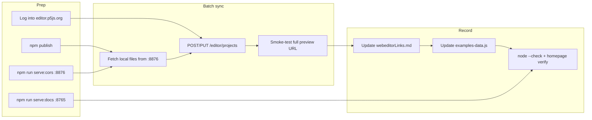

# p5 Web Editor — Maintainer Workflow

This folder documents how p5-phone maintainers batch-sync local examples to [editor.p5js.org](https://editor.p5js.org/) and keep the homepage catalog up to date.

**Living migration log:** [webeditorLinks.md](../../webeditorLinks.md) (sketch IDs and verification status)

**Detailed batch procedure:** [batch-sync.md](./batch-sync.md)

## When to use this workflow

- Local example files changed and public Web Editor sketches need updating
- A new npm release changed the CDN version pin (`p5-phone@VERSION`)
- Stale `creationcomputation` or old-account links need replacing under your maintainer account

Fork maintainers: replace `npuckett` with your Web Editor username when recording URLs.

## Prerequisites

1. **npm publish complete** if the batch depends on a new CDN version
2. **Logged in** to [editor.p5js.org](https://editor.p5js.org/) as the target account
3. **Node.js** and repo dependencies installed (`npm install`)

## Two local servers

Run both from the **repository root** in separate terminals:

| Command | Port | Purpose |
|---------|------|---------|
| `npm run serve:docs` | 8765 | Preview the homepage catalog while editing `examples-data.js` |
| `npm run serve:cors` | 8876 | CORS-enabled static server so browser automation can fetch local example files |

```bash
# Terminal 1 — docs preview
npm run serve:docs
# Open http://localhost:8765/examples/homepage/

# Terminal 2 — CORS file server for batch sync
npm run serve:cors
# Files available at http://127.0.0.1:8876/...
```

Stop both servers when the batch is finished.

## Workflow overview



## Quick paths

| Task | Document |
|------|----------|
| Full batch sync (automation or manual) | [batch-sync.md](./batch-sync.md) |
| Record sketch URLs after migration | [webeditorLinks.md](../../webeditorLinks.md) |
| npm release + version pin sweep | [CONTRIBUTING.md](../../CONTRIBUTING.md) |
| End-user duplicate-and-edit workflow | [doNotTouchWorkshop/index.html](../../doNotTouchWorkshop/index.html) |

## Related files

- `examples/homepage/scripts/examples-data.js` — catalog `webEditor` fields
- `doNotTouchWorkshop/scripts/workshop-data.js` — workshop Web Editor links
- `.github/skills/p5-phone/SKILL.md` — agent guidance for portable examples
